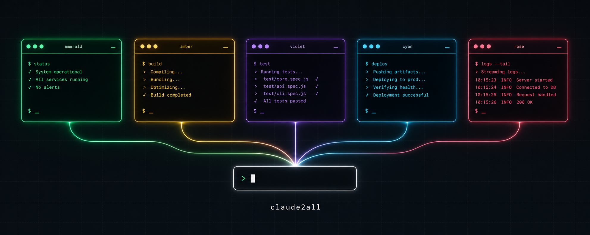

<p align="center">
  
</p>

<h1 align="center">claude2all</h1>

<p align="center">
  Run Claude Code on every backend and account you have — side by side, never interfering.
</p>

<p align="center">
  <a href="#quick-start">Quick start</a> •
  <a href="#way-1-standalone-in-your-terminal">Standalone</a> •
  <a href="#way-2-inside-claude-code-subagents">Subagents</a> •
  <a href="#setup-per-backend">Setup</a> •
  <a href="#how-it-works">How it works</a>
</p>

One small launcher per backend. Each gets its own isolated profile (config, login,
history, settings), so sessions never touch each other — or your main `claude`.
Windows + Git Bash first; every launcher also has a `.cmd` twin for PowerShell.

## Quick start

```bash
git clone https://github.com/sgeraldes/claude2all
cd claude2all
./install.sh        # copies launchers to ~/.local/bin, subagents to ~/.claude/agents
```

Then set up the backends you want (see [Setup per backend](#setup-per-backend)) and:

```bash
claude2kimi        # Claude Code, powered by Kimi K3
claude2bedrock     # Claude Code, powered by your AWS Bedrock account
claude2work        # Claude Code on your second claude.ai subscription
```

## Way 1: Standalone (in your terminal)

Each launcher is a full Claude Code session on that backend — anything `claude`
accepts works:

```bash
claude2kimi                          # interactive session
claude2kimi -p "explain src/api/"    # one-shot headless answer
claude2bedrock --resume              # resume last session (per-profile history)
```

| Launcher | Backend | Models it loads |
|---|---|---|
| `claude2kimi` | [Kimi Code](https://www.kimi.com/code/docs) plan | `k3[1m]` main · `kimi-for-coding` sonnet · `kimi-for-coding-highspeed` haiku |
| `claude2kiro run` | AWS Kiro via **[claude2kiro](https://github.com/sgeraldes/claude2kiro)** | nothing pinned — `auto`, Kiro picks per request |
| `claude2bedrock` | AWS Bedrock (your account) | opus 4.8 main · sonnet 5 sonnet · haiku 4.5 (configurable) |
| `claude2openai` | OpenAI via ChatGPT OAuth (Codex CLI session) | `gpt-5.6-sol` main · `gpt-5.6-terra` sonnet · `gpt-5.6-luna` haiku |
| `claude2personal` | claude.ai subscription #1 | unpinned (account default; `/model` to change) |
| `claude2work` | claude.ai subscription #2 (team) | unpinned |

## Way 2: Inside Claude Code (subagents)

The installer also drops delegation subagents into `~/.claude/agents/`. Inside any
regular Claude Code session you just ask in natural language:

```
> use the kimi-k3 subagent to review src/auth.ts
> have the bedrock subagent write the terraform for an S3 bucket
```

Claude stays the orchestrator; the named backend does the delegated work headlessly
(`claude2<backend> -p "<task>"`) and returns its output. Available subagents:
`kimi-k3`, `kiro`, `bedrock`, `openai`. Check `/agents` in a session to see them.

## Setup per backend

- **`claude2kimi`** — paste your Kimi Code API key into `~/.claude2kimi/config`
  (Kimi Code Console → Create API Key).
- **`claude2bedrock`** — set `AWS_PROFILE` in `~/.claude2bedrock/config` to an SSO
  profile with Bedrock access; first run does `aws sso login` for you. Model IDs must
  be enabled for the *InvokeModel* path (Converse-enabled is not enough — the config
  comments have the check command).
- **`claude2kiro`** — install **[sgeraldes/claude2kiro](https://github.com/sgeraldes/claude2kiro)**
  (proxy with login, TUI dashboard, credits tracking) and use `claude2kiro run`.
- **`claude2openai`** — log into the Codex CLI once (`codex login`), then build the
  `claude2openai` proxy from its sibling repo (coming soon) and place the binary at
  `~/.claude2openai/claude2openai.exe`.
- **`claude2personal`** — nothing to do; it imports your existing `~/.claude` login once.
- **`claude2work`** — first run opens browser OAuth; sign in with the second account.

## How it works

Each launcher is a ~70-line bash script: point `CLAUDE_CONFIG_DIR` at an isolated
profile (`~/.claude-profiles/<backend>`), seed it (merge-only — your
bypass-permissions preference, workspace trust, statusline, global `CLAUDE.md`,
skills, and MCP servers follow you), export the backend's env vars and model pins,
then `exec claude "$@"`. No daemons except where a backend needs a protocol proxy
(Kiro, OpenAI). Nothing touches your main `~/.claude`.

## Related

- **[sgeraldes/claude2kiro](https://github.com/sgeraldes/claude2kiro)** — the Kiro
  proxy (this repo links to it; it links back here).
- `claude2openai` proxy — Anthropic→OpenAI Responses bridge (repo coming soon).

## License

MIT
